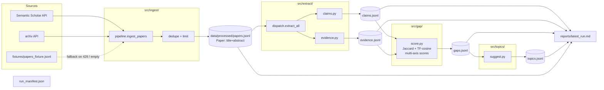
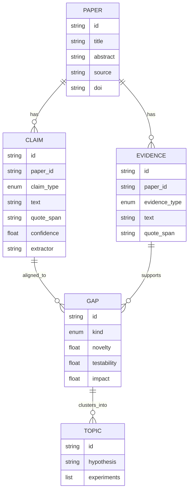
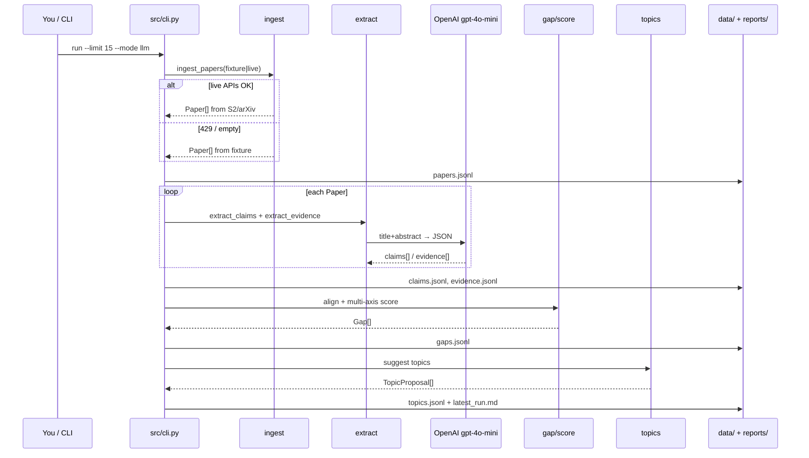

# FYP Research Gap Agent — architecture diagrams (Mermaid)

Accurate to code in `src/` as of 2026-07-29.  
Repo: https://github.com/vasanthsreeram/fyp-research-gap-agent

---

## 1. End-to-end pipeline (Stage 1 vertical slice)



---

## 2. How claims / “effects” are pulled (not full-PDF dump)

```mermaid
flowchart TB
  Paper["Paper object<br/>title + abstract<br/>(text_blob)"]

  Paper --> Mode{mode}

  Mode -->|heuristic| H["Sentence split<br/>regex triggers:<br/>theory / mechanism / domain"]
  Mode -->|llm| L["OpenAI chat.completions<br/>model = OPENAI_MODEL or gpt-4o-mini<br/>response_format = json_object"]
  Mode -->|auto| A{API key?}
  A -->|yes| L
  A -->|no| H

  H --> ClaimH["Claim<br/>paper_id, claim_type, text,<br/>quote_span, confidence, tags<br/>extractor=heuristic"]

  L --> Prompt["System: extract theory/mechanism claims<br/>User: Title + Abstract≤4000"]
  Prompt --> JSON['{"claims":[{text, claim_type, confidence, tags}]}']
  JSON --> ClaimL["Claim<br/>same schema<br/>extractor=llm"]
  L -. fail .-> H

  Paper --> ModeE{evidence mode}
  ModeE -->|heuristic / llm| Ev["Evidence<br/>result / metric / limitation<br/>+ quote_span"]

  ClaimH --> Align
  ClaimL --> Align
  Ev --> Align

  Align["gap/score.py<br/>align claim ↔ evidence<br/>lexical similarity"]
  Align --> Gap["Gap scored on<br/>magnitude · novelty · testability · impact"]
  Gap --> Topics["topics/suggest.py<br/>3–5 TopicProposal<br/>hypothesis + experiments"]
```

**LLM call shape (exact):** one paper at a time — **not** the whole corpus JSON.

```
POST chat.completions
  model: gpt-4o-mini (default) or $OPENAI_MODEL
  messages: [system extraction instructions, user: Title + Abstract]
  response_format: { type: "json_object" }
→ parse claims[] / evidence[] → Pydantic → jsonl
```

Key: every extract keeps `paper_id` + `quote_span` (citation grounding / anti-hallucination hook).

---

## 3. Data model (Pydantic)



---

## 4. Stage 1 vs Stage 2

```mermaid
flowchart TB
  subgraph S1["Stage 1 — vertical slice ✅"]
    s1a[Schemas Paper/Claim/Evidence/Gap/Topic]
    s1b[Ingest S2+arXiv+fixture]
    s1c[Heuristic + LLM extractors]
    s1d[Lexical gap scorer]
    s1e[Topic suggester]
    s1f[CLI + markdown report + 23 tests]
    s1a --> s1b --> s1c --> s1d --> s1e --> s1f
  end

  subgraph S2["Stage 2 — packaging + quality"]
    s2a[✅ Modular packages src/ingest|extract|gap|topics]
    s2b[✅ Claim recall lift + LLM E2E]
    s2c[⬜ Embedding gap alignment]
    s2d[⬜ Memorization / post-cutoff held-out]
    s2e[⬜ Corpus 50+ live]
    s2f[⬜ HTML report + 2nd domain]
  end

  S1 --> S2
```

---

## 5. Runtime sequence (one `cli run`)



---

## 6. Latest numbers (LLM, limit 15)

| Metric | Count |
|--------|------:|
| Papers | 15 |
| Claims | 91 |
| Evidence | 102 |
| Gaps | 47 |
| Topics | 5 |
| pytest | 23/23 |

Demo:

```bash
cd ~/projects/fyp-research-gap-agent
python -m src.cli run --limit 15 --fixture --mode llm
```

Supervisor draft: `docs/supervisor-update-draft.md`  
Machine YAML: `docs/architecture.yaml`
